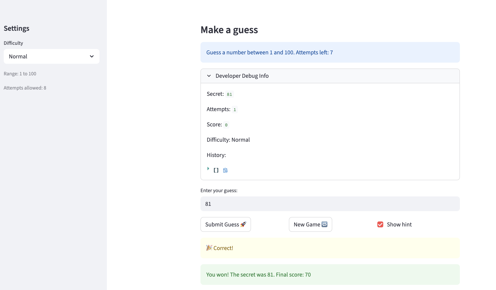
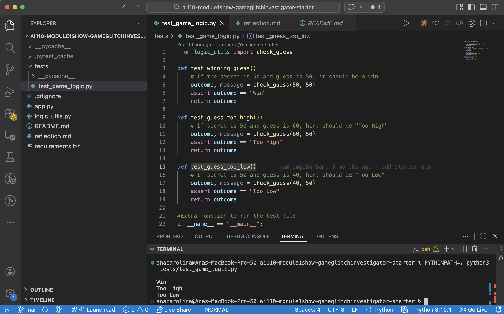

# 🎮 Game Glitch Investigator: The Impossible Guesser

## 🚨 The Situation

You asked an AI to build a simple "Number Guessing Game" using Streamlit.
It wrote the code, ran away, and now the game is unplayable. 

- You can't win.
- The hints lie to you.
- The secret number seems to have commitment issues.

## 🛠️ Setup

1. Install dependencies: `pip install -r requirements.txt`
2. Run the broken app: `python -m streamlit run app.py`

## 🕵️‍♂️ Your Mission

1. **Play the game.** Open the "Developer Debug Info" tab in the app to see the secret number. Try to win.
2. **Find the State Bug.** Why does the secret number change every time you click "Submit"? Ask ChatGPT: *"How do I keep a variable from resetting in Streamlit when I click a button?"*
3. **Fix the Logic.** The hints ("Higher/Lower") are wrong. Fix them.
4. **Refactor & Test.** - Move the logic into `logic_utils.py`.
   - Run `pytest` in your terminal.
   - Keep fixing until all tests pass!

## 📝 Document Your Experience

- [ ] Describe the game's purpose.
- [ ]    This is a number-guessing game built with Python and Streamlit where players try to guess a secret number within a certain range and a limited number of attempts. The game tracks a score that rewards correct guesses and penalizes wrong ones.
- [ ] Detail which bugs you found.
- [ ]    The check_guess function returned "Go LOWER" when the guess was too low and "Go HIGHER" when too high;
- [ ]    Wrong difficulty ranges;
- [ ]    st.session_state.attempts started at 1 instead of 0, so the first guess was recorded as attempt 2;
- [ ]    "New Game" didn't reset the game status
- [ ]    Logic was not separated from the UI with the logic_utils.py file.
- [ ] Explain what fixes you applied.
- [ ]    Hints were corrected in check_guess;
- [ ]    Attempt counter was fixed
- [ ]    Logic was refactored into logic_utils.py

## 📸 Demo

- [ ] 
- [ ] 

## 🚀 Stretch Features

- [ ] [If you choose to complete Challenge 4, insert a screenshot of your Enhanced Game UI here]
